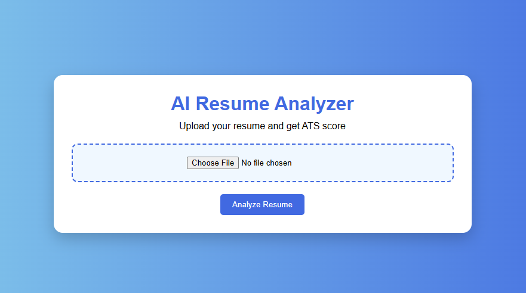
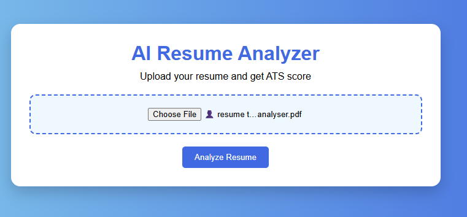
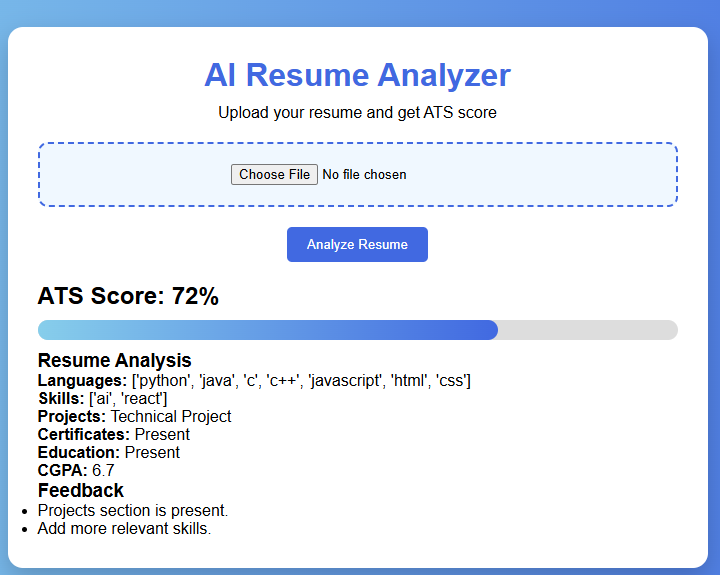

 AI Powered Resume Analyzer

## Description
This project analyzes resumes using AI techniques and provides feedback to improve content quality and job matching.

## Features
- Resume analysis
- Skill extraction
- Suggestions for improvement
- User-friendly interface

## Technologies Used
- Python (Flask)
- HTML, CSS
## Project Screenshots

### Screenshot 1

### Screenshot 2

### Screenshot 3

